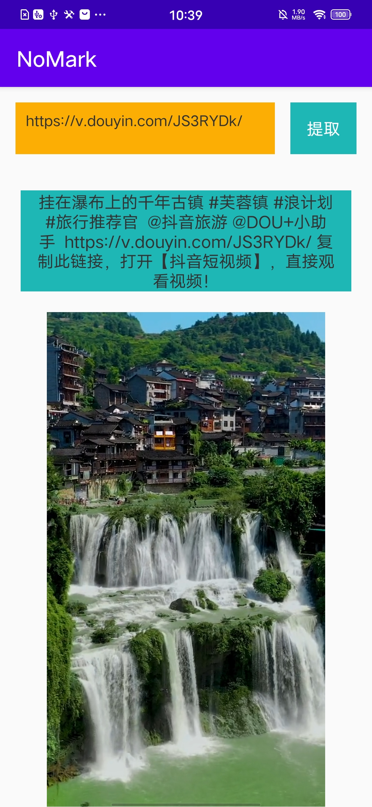

## 短视频去水印

## 支持的短视频平台

- [x] 快手
- [x] 抖音
- [x] 微视
- [ ] 火山
- [ ] 头条
- [ ] 皮皮虾
- [ ] 微博
- [ ] 未完待续...

## 原理：

    使用User-Agent模拟手机浏览器

### 1.快手

    1、短视频链接 重定向 拿到重定向的url
    2、然后请求url 拿到body 加载到Document
    3、然后找到script标签 内文字 类似于："window.pageData={jsonstr}"
    4、然后json解析 拿到video内的srcNoMark 就是没有水印的链接

    
### 2.抖音

    1、短视频链接 重定向 拿到重定向的url
    2、然后根据url拿到id(目前是/分割的第六个值 很明显)
    3、然后id 拼接一个新url  
    4、拿到新url的body(json串)解析
    5、找到item_list下的video下的play_addr下的url_list
    6、然后将得到的url中playwm替换为play
    7、然后再重定向 拿到没有水印的链接
    
    
### 3.微视

    1、根据url拿到feedid(目前是/分割的第六个值)
    2、然后生成一个随机数 拼接一个新url 
    3、然后添加datalvl、feedid等参数
    4、post拿到body(json串)解析
    5、找到data下的feeds下的video_url 就是没有水印的链接

   

## 截图

 